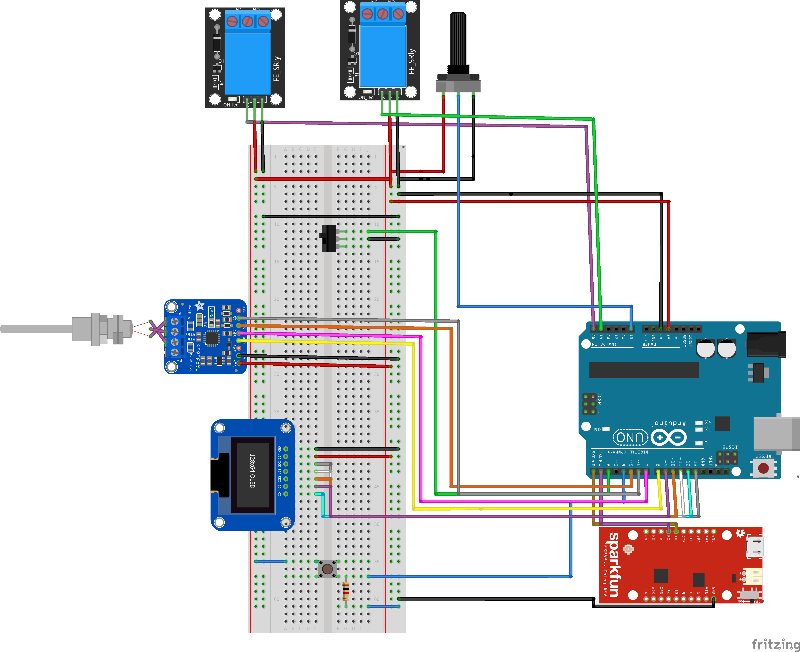

# Introduzione

La nostra idea era quella di creare un regolatore di temperatura che ci
permettesse di mantenere temperature stabili entro piccoli range, adatto
quindi più ad un uso industriale piuttosto che casalingo. Il termostato
rileva con una frequenza (aggiustabile) di ogni secondo la temperatura
tramite una termocoppia, per una migliore precisione, e in base ai
valori registrati e alla temperatura impostata decide se vi è necessità
di scaldare o raffreddare l'ambiente. Tramite opportuna logica evitiamo
che vi sia un sussegguirsi di on/off e lavoriamo su un determinato range
per cercare di fare salvaguarda di risorse.

L'interfacciamento col termostato avviene tramite un piccolo schermo
oled che presenta 3 schermate:

-   **Main Page**: dove vediamo la temperatura rilevata, la temperatura
    goal e se il nostro termostato ha attivato riscaldamento,
    raffreddamento;

-   **Second Page**: dove possiamo impostare la temperatura goal che
    vogliamo raggiungere;

-   **Off Page**: se il termostato viene spento andremo in questa pagina
    dove verrà semplicemente visualizzata la temperatura corrente.

Inoltre, il termostato invierà periodicamente i dati rilevati ed
elaborati in cloud e sarà quindi possibile accedere da remoto per
visualizzarne l'andamento temporale. Per rendere possibile il tutto
abbiamo pensato ad un architettura master slave nella quale il nostro
arduino uno (slave) esegue le rilevazioni, gestisce il monitor, esegue
le computazioni e invia i dati all'esp32 (master) che si occupa di
mandare il tutto in cloud. Come piattaforma cloud pensavamo di
appoggiarci a thingspeak, il quale offre di base una visualizzazione dei
dati ricevuti e inoltre permette la creazione di propri grazie a matlab.

# Componenti usati
  -  Esp32
  - Arduino Uno    
  - Schermo oled    
  - Potenziometro   
  - Bottone         
  - Resistenze      
  - Switch          
  - Led             
  - Relé            
  - Termocoppia     

# Realizzazione

Per la realizzazione prima di tutto ci siamo avvalorati dell'uso di un
sito per simulare i componenti online: wokwi. Nell'attesa di ricevere
fisicamente i componenti abbiamo appunto completato lo sketch di arduino
e dell'esp simulando il passaggio di dati tra i due microcontrollori,
che online non si poteva fare. Abbiamo scritto buona parte del codice
sviluppando contemporaneamente lo schema fisico dei componenti su
Fritzing. E' stata nostra premura focalizzarci attentamente sul
controllo del raggiungimento della temperatura obiettivo. Volendo
abbracciare la filosofia PID abbiamo realizzato un algoritmo per gestire
al meglio lo spegnimento/accensione di pompa di calore e raffreddamento
in maniera intelligente. Tramite il potenziometro si imposta un
obiettivo di calore (goal) da raggiungere, arduino elaborerà un
intervallo di "accettabilità" pari a ±0.5gradi entro i quali viene
accettata la temperatura rilevata. Se però era in atto un
riscaldamento/raffreddamento, quest'ultimo non viene spento prima di
aver raggiunto una soglia maggiore uguale a +0.25 al goal se stava
riscaldando, o minore uguale a -0.25 al goal se stava raffreddando. Una
volta ricevuti i componenti abbiamo iniziato l'assemblaggio vero e
proprio del progetto, rinfacciando subito dei problemi con certi
componenti. Abbiamo sostituito lo schermo oled e il potenziometro, il
cui feedback non rispettava il comportamento che ci serviva. Dopo aver
montato tutto come da schema siamo passati alla manipolazione dei dati
in cloud. Per il cloud abbiamo scelto Thingspeak in quanto nella sua
licenza gratis riusciva ad adempiere a tutte le nostre richieste. Ogni
16 secondi salviamo dei dati in cloud in 4 canali differenti:
temperatura attuale, temperatura obiettivo, bit di flag riscaldamento
attivo, bit di flag raffreddamento attivo. Successivamente abbiamo unito
i 4 canali dati in uno solo, usando mathlab siamo arrivati ad avere un
unico grafico per visualizzare in chiaro tutti i dati.

Infine, abbiamo creato una pagina php responsive, hostata su Altervista,
per visualizzare comodamente da pc o smartphone i dati elaborati da
mathlab. Il frame della finestra di mathlab purtroppo si aggiorna solo
ogni 15 secondi, causa limiti della licenza, la temperatura attuale
invece ogni 16. Link al sito:
[http://checkitout.altervista.org/dati.php ](http://checkitout.altervista.org/dati.php )

Librerie utilizzate:

-   **DallasTemperature** : per la lettura della temperatura

-   **U8g** : per la gestione dello schermo oled

-   **Wifi** : per connettere l'esp32 a internet

-   **OneWire** : per comunicare con i componenti (legato a
    DallasTemperature)

# Schema Collegamenti 

**Immagine 8:** Qui vediamo lo schema dei collegamenti tra i componenti
utilizzati nel progetto.

# Riferimenti 

- Per l'interfaccia dove viene impostata la temperatura goal ci siamo
ispirati a questo progetto, riadattandone alcune parti in modo che fosse
compatibile con i nostri range e i nostri componenti:
<https://www.youtube.com/watch?v=NPfaLKKsf_Q&list=PLSPeQu-8Pue2YBXg1Bcz_mh_08k9h_Fr3&index=2&t=2328s&ab_channel=upir>
- Per la visualizzazione dei dati in Matlab abbiamo trovato tutte le
informazioni utili sulla documentazione ufficiale:
<https://it.mathworks.com/help/matlab/index.html?s_tid=hc_panel>
- Per l'utilizzo della libreria U8G ci siamo appoggiati alla documentazione
fornita su github:
[https://github.com/olikraus/u8glib/wiki/userreference ](https://github.com/olikraus/u8glib/wiki/userreference )
- Per la ricerca di soluzioni ad eventuali problemi avuti con l'hardware
ci siamo affidati ai vari forum su arduino:
[https://github.com/olikraus/u8glib/wiki/userreference ](https://github.com/olikraus/u8glib/wiki/userreference )
